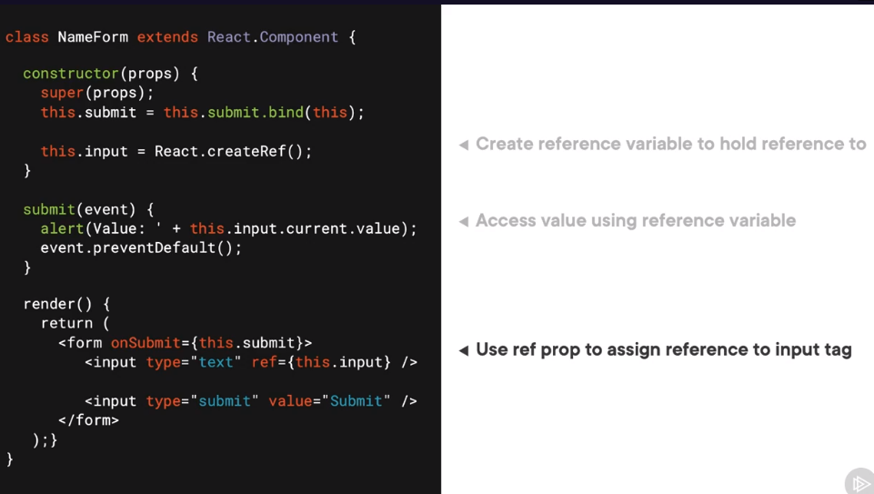
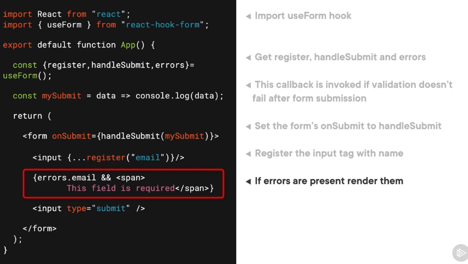
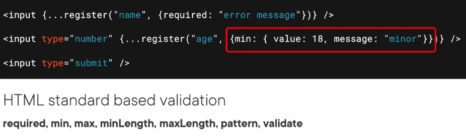
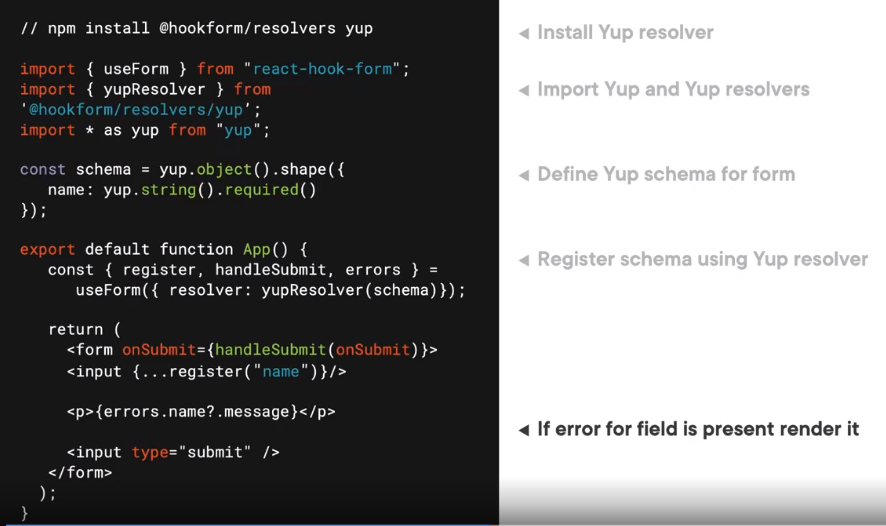

Setting the value or checked prop on a field makes the element a controlled element.

# Steps for Creating an Uncontrolled form
1. Create reference - using `React.createRef()` in constructor.
2. Assign reference - Using ref prop on form element.
3. Extra value - Using the refersnce created in constructor.

## When to use uncontrolled forms
1. For read-only elements like life input.
2. When using a non-react library for form elements in a React app.
3. When converting a preexisting codebase to React.
4. To reduce re-rendering the form in a complex DOM.

# Integrating react Hook fortm in yout app
1. To install run: npm install react-hook-form
2. The useForm hook is used to access register, handleSubmit methods and the errors object.
3. useForm hook accepts configs to alter the behavior of the form.
4. Configs: 
    - Mode - allows control for when the validation should be run, 
    - DefaultValues, 
    - Resolver - allows you to provide a function to run schema based based validations on the form.
### Usage

## HTML Validation

## Schema based validation
